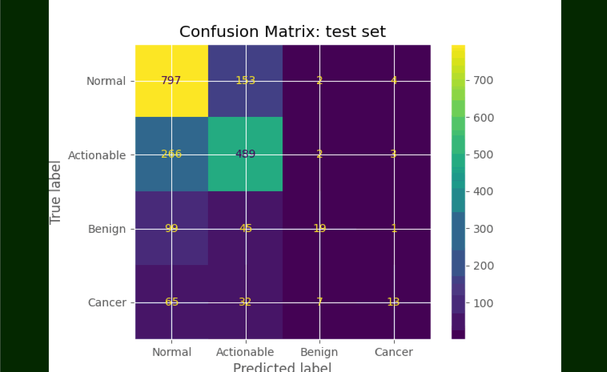

## Key Points

### **Question**:

Can a single AI/ML researcher create a model which achieves a higher accuracy score than Duke University's 65%[^1] in diagnosing breast cancer from medical images?

### **Findings**:

Using the same dataset as the DBT study[^2], 22 032 reconstructed DBT volumes from 5060 patients, several deep learning algorithms & models for breast cancer detection were developed and tested, with a maximum accuracy of 62% achieved. This was however done using the built in scikit algorithms with no fine tuning & very few iterations due to lack of funding for more extensive research.

```sh
              precision    recall  f1-score   support

    Normal 0       0.62      0.80      0.70       956
Actionable 1       0.61      0.58      0.59       760
    Benign 2       0.69      0.07      0.12       164
    Cancer 3       0.47      0.08      0.13       117

    accuracy                           0.62      1997
   macro avg       0.60      0.38      0.39      1997
weighted avg       0.61      0.62      0.58      1997
```

### **Meaning**:

Significant increases in accuracy for AI/ML models which make cancer prognoses should lie in store for future researchers who are better staffed & funded. The research only covered k-nearest neighbors, support vector machines, and random forrest classifiers so there are several more advanced algorithms which might increase the accuracy which have yet to be tested.

## Abstract

### **Importance**:

There has been significant hype for computer vision aiding in the identifying cancer early in patients which increases the probability that it can be operated on. However after years of headlines current models still fail to identify cancer more accurately than humans. To achieve the vision of artificial intelligence diagnosing cancer accurately which was first predicted over 20 years ago[^3].

### **Objectives**:

To serve as a demonstration and proof of concept to non AI/ML engineers that developing ML models isn't so far fetched given some research into the field (weeks not months). To galvanize continued research to elevate the current accuracy of models. To

[^1]: [Duke Study](https://jamanetwork.com/journals/jamanetworkopen/fullarticle/2783046)
[^2]: [Cancer Imaging Archive](https://www.breastcancer.org/facts-statistics)
[^3]: [Computerized detection of breast cancer with artificial intelligence and thermograms](https://pubmed.ncbi.nlm.nih.gov/12396330/)
